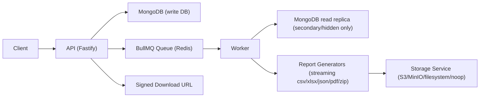

# ReportSys

High-throughput report generation system built with Node.js, MongoDB replica sets, streaming file generation, and streaming uploads to object storage.

This project is designed for technical assessments and real-world workloads where report jobs can process large datasets without loading everything into memory.

## Table of Contents

- [What This Project Solves](#what-this-project-solves)
- [Core Technical Requirements](#core-technical-requirements)
- [Architecture Overview](#architecture-overview)
- [Key Design Decisions](#key-design-decisions)
- [Tech Stack](#tech-stack)
- [Repository Structure](#repository-structure)
- [How Data Flows](#how-data-flows)
- [Running Locally](#running-locally)
- [API Quick Start](#api-quick-start)
- [Report Processing Details](#report-processing-details)
- [MongoDB Read Replica Enforcement](#mongodb-read-replica-enforcement)
- [Storage Modes and Failure Policy](#storage-modes-and-failure-policy)
- [Configuration](#configuration)
- [Testing](#testing)
- [Performance Benchmark](#performance-benchmark)
- [Troubleshooting](#troubleshooting)
- [Current Limitations](#current-limitations)

## What This Project Solves

ReportSys addresses common reporting-system bottlenecks:

- Large dataset processing without memory explosion.
- Multi-format output generation (`csv`, `xlsx`, `json`, `pdf`).
- Streamed archive generation (`zip`) for one or many files.
- Streamed upload to object storage (S3/MinIO/filesystem).
- Strong operational safety by reading report data only from non-primary MongoDB replica members.
- Fast grouped metrics via partitioned reduce execution.

## Core Technical Requirements

The project was built to satisfy these requirements:

- Backend in Node.js.
- MongoDB as database.
- Report system able to handle many records.
- Use streams to generate files (`xlsx`, `csv`, `json`, `pdf`).
- Use streams to generate archives (`zip`).
- Use streams to upload to object storage / S3.
- Consume report reads only from hidden or secondary replica.
- Support map-reduce style report acceleration.

Note on map-reduce: this implementation uses partitioned aggregation-based reduce (faster and more controllable in modern MongoDB) rather than the legacy `mapReduce` command.

## Architecture Overview



Main components:

- `API` accepts report/schedule requests and persists jobs.
- `Worker` consumes queue jobs and performs heavy processing.
- `MongoDB` split connections:
  - write client for API writes;
  - read client with `ReadPreference.SECONDARY` for report source reads.
- `StorageService` uploads generated streams and returns metadata.
- `Scheduler` periodically enqueues jobs from saved schedules.

## Key Design Decisions

### 1) Streaming-first processing

All report outputs are generated from async iterables/streams. This avoids accumulating full datasets in memory.

### 2) Async queue for heavy work

API remains responsive by offloading report generation to BullMQ workers.

### 3) Replica-safe reads

Worker validates read target with `hello` command and fails if it points to primary.

### 4) Partitioned reduce engine

Reduce workloads are partitioned by `_id` ranges (`objectIdRange`) and merged deterministically.

### 5) Graceful integration fallback

External storage can run in strict mode (fail job) or optional mode (fallback to `noop` and complete job).

## Tech Stack

- API: Fastify + BullMQ
- Worker: Node.js + Streams
- Database: MongoDB replica set (includes hidden secondary)
- Queue: Redis
- Storage: AWS S3 / MinIO / local filesystem / noop
- Validation: Zod
- Tests: Vitest (unit + integration + coverage)

## Repository Structure

```text
apps/
  api/                 HTTP API + request validation + queue enqueue
  worker/              Report execution, reduce engine, scheduler
packages/
  contracts/           Shared domain types and API contracts
  core/                Config, mongo connections, logger, constants
  report-generators/   Streaming generators for csv/xlsx/json/pdf/zip
  storage-s3/          Streaming upload and signed URL service
infrastructure/
  mongo-init/          Replica set bootstrap script (hidden node setup)
tests/
  integration/         End-to-end scenarios with Docker stack
  perf/                Benchmark script
```

## How Data Flows

1. Client calls `POST /v1/reports`.
2. API validates payload, persists job as `queued`, and enqueues BullMQ task.
3. Worker picks job, sets status `running`, validates read replica, fetches rows.
4. Worker generates stream (`csv` / `xlsx` / `json` / `pdf` / `zip`).
5. Worker streams result to storage.
6. Worker sets job to `uploaded` with artifact metadata and processing stats.
7. Client polls `GET /v1/reports/:jobId` and fetches `GET /v1/reports/:jobId/download`.

## Running Locally

### Prerequisites

- Node.js `>=22`
- Docker + Docker Compose

### 1) Start full stack with Docker

```bash
docker compose up --build
```

This starts:

- Mongo replica set (`mongo1`, `mongo2`, `mongo3`)
- Hidden replica initialization (`mongo-init-rs`)
- Redis
- MinIO + bucket init (`mc-init`)
- API
- Worker

### 2) Health check

```bash
curl http://127.0.0.1:3000/health
```

Expected response example:

```json
{
  "status": "ok",
  "storageDriver": "minio",
  "externalStorageEnabled": true
}
```

### 3) Local dev without Docker (advanced)

You can run API and worker directly, but you still need reachable services (Mongo replica set, Redis, and optional storage):

```bash
npm install
npm run build
npm run dev
```

Or separately:

```bash
npm run dev:api
npm run dev:worker
```

## API Quick Start

All endpoints except `/health` require:

- `X-API-Key`
- `X-Tenant-Id`

Default local API key:

- `local-dev-key`

### Create report

```bash
curl -X POST http://127.0.0.1:3000/v1/reports \
  -H "content-type: application/json" \
  -H "x-api-key: local-dev-key" \
  -H "x-tenant-id: tenant-a" \
  -d '{
    "reportDefinitionId": "sales-report",
    "format": "csv",
    "sourceCollection": "reportSource"
  }'
```

### Check status

```bash
curl http://127.0.0.1:3000/v1/reports/<jobId> \
  -H "x-api-key: local-dev-key" \
  -H "x-tenant-id: tenant-a"
```

### Get download link

```bash
curl http://127.0.0.1:3000/v1/reports/<jobId>/download \
  -H "x-api-key: local-dev-key" \
  -H "x-tenant-id: tenant-a"
```

If available:

```json
{ "available": true, "url": "..." }
```

If noop / unavailable:

```json
{ "available": false, "mode": "noop", "reason": "EXTERNAL_STORAGE_DISABLED" }
```

## Report Processing Details

### Supported formats

- `csv`
- `xlsx`
- `json` (JSON array stream)
- `pdf`
- `zip`

### Zip modes

- `format=zip` + `includeFormats`: multi-file zip output.
- `compression=zip` on non-zip formats: wraps single generated report into zip.

### Reduce mode

Provide:

- `reduceSpec` with `groupBy` and metrics (`count`, `sum`, `min`, `max`, `avg`)
- optional `partitionSpec` with strategy `objectIdRange`

Execution behavior:

- Determine min/max `_id`.
- Split ranges into chunks.
- Run aggregation per chunk.
- Merge chunk partials into final deterministic output.

### Raw mode

Without `reduceSpec`, worker streams rows from source collection sorted by `_id`.

### Zip strategy modes

- `snapshot` mode: builds a temporary NDJSON snapshot, then generates each entry stream.
- `multipass` mode: re-reads source collection per entry stream (no snapshot).

Flag:

- `REPORT_ZIP_MULTIPASS_ENABLED=true` enables multipass strategy for raw zip jobs.

## MongoDB Read Replica Enforcement

Safety is implemented in three layers:

1. Dedicated read URI (`MONGODB_REPORT_READ_URI`) configured to secondary/hidden.
2. Mongo read client created with `ReadPreference.SECONDARY`.
3. Runtime assertion via `hello` command:
   - if `isWritablePrimary=true`, worker throws and job fails.

This prevents heavy report queries from hitting primary by mistake.

## Storage Modes and Failure Policy

`STORAGE_DRIVER` options:

- `s3`
- `minio`
- `filesystem`
- `noop`

Behavior:

- `ENABLE_EXTERNAL_STORAGE=false` always forces `noop`.
- `INTEGRATION_STRICT_MODE=true` means storage failures fail the job.
- `INTEGRATION_STRICT_MODE=false` means storage failures fallback to noop and still complete the job.

## Configuration

Main environment variables:

| Variable | Description | Default |
|---|---|---|
| `NODE_ENV` | Runtime environment | `development` |
| `PORT` | API port | `3000` |
| `MONGODB_DB_NAME` | Mongo database | `reportsys` |
| `MONGODB_WRITE_URI` | Mongo write connection URI | `mongodb://mongo1:27017/reportsys?replicaSet=rs0` |
| `MONGODB_REPORT_READ_URI` | Mongo report read URI (secondary/hidden) | `mongodb://mongo3:27017/reportsys?replicaSet=rs0&readPreference=secondary&directConnection=true` |
| `REDIS_URL` | Redis connection | `redis://redis:6379` |
| `STORAGE_DRIVER` | Storage mode (`s3|minio|filesystem|noop`) | `minio` |
| `ENABLE_EXTERNAL_STORAGE` | Enable external storage uploads | `true` |
| `INTEGRATION_STRICT_MODE` | Required integrations fail job when true | `false` |
| `S3_ENDPOINT` | Internal S3/MinIO endpoint | `http://minio:9000` |
| `S3_PUBLIC_ENDPOINT` | Public endpoint for signed URL generation | `http://localhost:9000` |
| `S3_REGION` | S3 region | `us-east-1` |
| `S3_BUCKET` | Bucket name | `reportsys` |
| `S3_ACCESS_KEY_ID` | S3 access key | `minioadmin` |
| `S3_SECRET_ACCESS_KEY` | S3 secret key | `minioadmin` |
| `S3_FORCE_PATH_STYLE` | Path style for MinIO/S3-compatible setups | `true` |
| `FILESYSTEM_STORAGE_PATH` | Base path for filesystem mode | `/data/reports` |
| `SIGNED_URL_TTL_SECONDS` | Signed URL expiration | `900` |
| `REPORT_MAX_CONCURRENCY` | Worker queue concurrency | `4` |
| `REPORT_BATCH_SIZE` | Mongo cursor batch size | `2000` |
| `REPORT_STREAM_HIGH_WATER_MARK` | Stream buffer tuning | `65536` |
| `REPORT_PARTITION_DEFAULT_CHUNKS` | Default reduce partition chunk count | `32` |
| `REPORT_PARTITION_MAX_CONCURRENCY` | Max concurrent reduce chunk workers | `4` |
| `REPORT_REDUCE_ENGINE_V2_ENABLED` | Enable streaming accumulator reduce engine | `false` |
| `REPORT_ZIP_MULTIPASS_ENABLED` | Enable multipass zip generation | `false` |
| `REPORT_ALLOWED_SOURCE_COLLECTIONS` | Allowed source collections list | `reportSource` |
| `REPORT_REDUCE_MAX_GROUPS` | Max reduce groups safeguard | `500000` |
| `REPORT_SOURCE_INDEX_MANAGEMENT_ENABLED` | Auto-create source index (`tenantId,_id`) | `true` |
| `REPORT_TMP_DIR` | Temp directory for snapshots | `/tmp/reportsys` |
| `REPORT_TMP_MAX_BYTES` | Max temporary snapshot bytes | `2147483648` |
| `REPORT_PDF_MAX_ROWS` | Max rows allowed in PDF output | `10000` |
| `ARTIFACT_RETENTION_DAYS` | Report artifact retention | `30` |
| `API_KEY_HASH_PEPPER` | API key hashing pepper | `change-me` |
| `DEV_API_KEY` | Local development API key | `local-dev-key` |
| `SCHEDULE_POLL_INTERVAL_MS` | Scheduler poll interval | `30000` |

See `.env.example` for a ready-to-use configuration template.

## Testing

### Unit tests

```bash
npm run test:unit
```

### Coverage + thresholds

```bash
npm run test:coverage
```

The project enforces coverage thresholds in `tests/coverage/check-thresholds.mjs`.

### Integration tests

Default end-to-end flow:

```bash
npm run test:integration
```

Flags flow (reduce v2 + zip multipass):

```bash
npm run test:integration:flags
```

Noop flow (external storage disabled):

```bash
npm run test:integration:noop
```

### Full local validation

```bash
npm run test:all
```

## Performance Benchmark

Run benchmark script (seeds dataset, executes raw and reduce jobs, prints throughput):

```bash
REPORTSYS_BASE_URL=http://127.0.0.1:3000 npm run test:perf -- --rows=1000000
```

Notes:

- Use `127.0.0.1` to avoid local IPv6/localhost routing issues.
- Benchmark output includes:
  - `rowsSeeded`
  - per-job `elapsedMs`
  - `rowsIn`, `rowsOut`
  - `throughputRowsPerSecond`
  - `memoryPeakBytes`

## Troubleshooting

### `Read replica connection is pointing to primary`

Cause:

- `MONGODB_REPORT_READ_URI` points to primary.

Fix:

- Point it to a secondary/hidden node and keep `readPreference=secondary`.

### `includeFormats is required when format=zip`

Cause:

- `format=zip` sent without `includeFormats`.

Fix:

- Provide one or more formats from `csv|xlsx|json|pdf`.

### `compression=zip cannot be used with format=zip`

Cause:

- Both zip strategies used at once.

Fix:

- Use either `format=zip` for multi-entry zip, or `compression=zip` for single format output.

### Download unavailable with noop response

Cause:

- External storage disabled or optional integration failure fallback.

Fix:

- Enable external storage and choose a real storage driver.
- For strict behavior, set `INTEGRATION_STRICT_MODE=true`.

## Current Limitations

- Reduce strategy is aggregation-based map-reduce style, not legacy Mongo `mapReduce` command.
- PDF output intentionally has a row cap (`REPORT_PDF_MAX_ROWS`) to avoid excessive memory/CPU.
- Source collection access is allowlist-based (`REPORT_ALLOWED_SOURCE_COLLECTIONS`) by design.

---

If you need, we can also provide:

- OpenAPI/Swagger documentation.
- Kubernetes deployment manifests.
- Terraform module examples for production infra.
